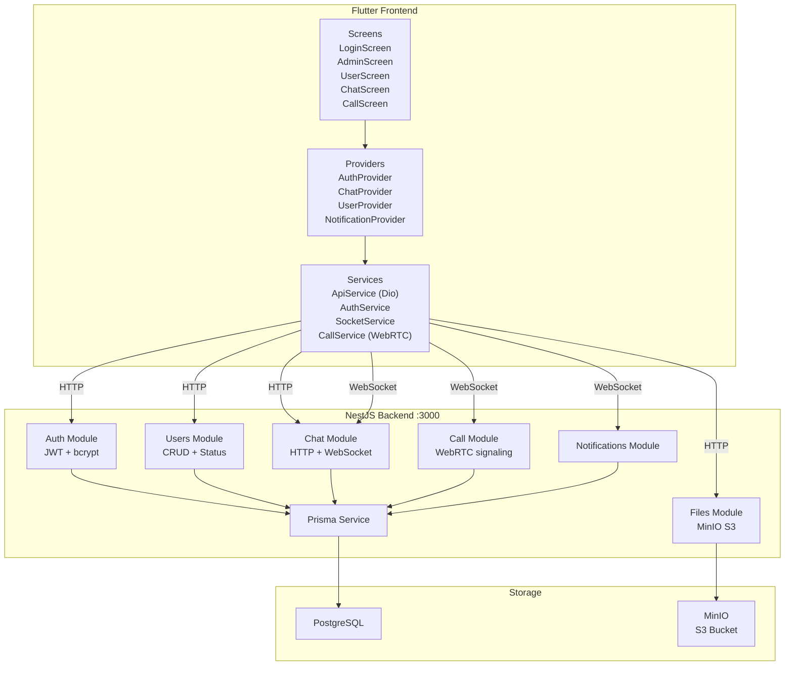

# Архитектура проекта N App

> **Версия:** 1.0.0  
> **Последнее обновление:** Июнь 2026  
> **Репозиторий:** `github.com/den063rus-design/n-app`

---

## 1. Общая архитектура

### 1.1. Описание системы

Система коммуникации администратора с пользователями. Представляет собой чат-приложение, где:
- **Администратор** может управлять пользователями (создавать, блокировать, архивировать, удалять) и общаться с ними в чате
- **Пользователи** могут отправлять сообщения администратору и получать ответы
- **Real-time** доставка сообщений через WebSocket (Socket.IO)
- **Видеозвонки** через WebRTC
- **Файловое хранилище** через MinIO (S3-совместимое)

### 1.2. Стек технологий

| Компонент | Технология | Версия |
|-----------|-----------|--------|
| Backend | NestJS | ^11.0.1 |
| ORM | Prisma | ^6.19.3 |
| База данных | PostgreSQL | через Prisma |
| Аутентификация | JWT + Passport | ^11.0.2 / ^11.0.5 |
| Хеширование паролей | bcrypt | ^6.0.0 |
| Real-time | Socket.IO | ^4.8.3 |
| Валидация | class-validator + class-transformer | ^0.15.1 / ^0.5.1 |
| Документация API | Swagger | ^11.4.4 |
| S3-клиент | @aws-sdk/client-s3 | ^3.1065.0 |
| Frontend | Flutter | >=3.0.0 |
| State management | Provider | ^6.1.1 |
| HTTP клиент | Dio | ^5.4.0 |
| WebSocket (Flutter) | socket_io_client | ^2.0.3+1 |
| WebRTC (Flutter) | flutter_webrtc | ^1.0.0 |

### 1.3. Схема взаимодействия компонентов



---

## 2. Backend архитектура

### 2.1. Структура модулей

```
src/
├── main.ts                          # Точка входа: CORS, ValidationPipe, Swagger, порт 3000
├── app.module.ts                    # Корневой модуль (7 модулей)
├── auth/                            # Модуль аутентификации
│   ├── auth.module.ts
│   ├── auth.controller.ts           # POST /auth/login
│   ├── auth.service.ts              # Логика login + validateUser
│   ├── jwt.strategy.ts              # Passport JWT Strategy
│   ├── dto/auth.dto.ts              # LoginDto, AuthResponseDto
│   └── guards/
│       ├── jwt-auth.guard.ts        # JwtAuthGuard
│       └── roles.guard.ts           # RolesGuard
├── users/                           # Модуль управления пользователями
│   ├── users.module.ts
│   ├── users.controller.ts          # CRUD + block/unblock/archive/restore/credentials
│   ├── users.service.ts             # Бизнес-логика (bcrypt, поиск, сортировка)
│   └── dto/
│       ├── create-user.dto.ts
│       ├── update-user.dto.ts
│       ├── update-credentials.dto.ts
│       └── query-users.dto.ts
├── chat/                            # Модуль чата
│   ├── chat.module.ts
│   ├── chat.controller.ts           # HTTP endpoints (send, list, delete)
│   ├── chat.service.ts              # Бизнес-логика (create, resolveReceiver, status)
│   ├── chat.gateway.ts              # Socket.IO gateway (connection, online status)
│   └── dto/
│       ├── create-message.dto.ts
│       ├── message-response.dto.ts
│       └── chat-history-query.dto.ts
├── files/                           # Модуль файлов (MinIO/S3)
│   ├── files.module.ts
│   ├── files.controller.ts          # POST upload, GET :key, DELETE :key
│   └── files.service.ts             # S3Client (Put/Get/DeleteObjectCommand)
├── call/                            # Модуль звонков (WebRTC)
│   ├── call.module.ts
│   ├── call.controller.ts           # GET my, GET history/:userId
│   ├── call.gateway.ts              # Socket.IO: call:start/accept/reject/end/signal
│   └── call.service.ts              # CRUD звонков
├── notifications/                   # Модуль уведомлений
│   ├── notifications.module.ts
│   ├── notifications.controller.ts  # GET my, PATCH read/read-all, GET unread-count
│   ├── notifications.gateway.ts     # Socket.IO: notification:new, unread_count
│   └── notifications.service.ts     # CRUD уведомлений
├── common/decorators/
│   ├── current-user.decorator.ts    # @CurrentUser()
│   └── roles.decorator.ts           # @Roles()
├── config/
│   ├── config.module.ts             # Пустой модуль (заглушка)
│   └── constants.ts                 # JWT secret + expiresIn (7d)
└── prisma/
    ├── prisma.module.ts             # Global модуль
    └── prisma.service.ts            # PrismaClient lifecycle
```

### 2.2. Схема БД (Prisma)

```mermaid
erDiagram
    User {
        int id PK "autoincrement"
        string fio "NOT NULL"
        int age "NOT NULL"
        string login UK "NOT NULL"
        string passwordHash "NOT NULL"
        enum Role role "default USER"
        enum UserStatus status "default ACTIVE"
        string notes "nullable"
        boolean isOnline "default false"
        datetime lastSeenAt "nullable"
        datetime createdAt "default now"
        datetime updatedAt "@updatedAt"
    }

    Message {
        int id PK "autoincrement"
        int senderId FK "NOT NULL"
        int receiverId FK "NOT NULL"
        string text "NOT NULL"
        enum MessageStatus status "default SENT"
        datetime createdAt "default now"
        datetime updatedAt "@updatedAt"
    }

    Attachment {
        int id PK "autoincrement"
        int messageId FK "NOT NULL, onDelete Cascade"
        string fileName "NOT NULL"
        string fileType "NOT NULL"
        int fileSize "NOT NULL"
        string key UK "NOT NULL"
        string url "NOT NULL"
        datetime createdAt "default now"
    }

    Call {
        int id PK "autoincrement"
        int callerId FK "NOT NULL"
        int calleeId FK "NOT NULL"
        enum CallStatus status "default PENDING"
        datetime startedAt "nullable"
        datetime endedAt "nullable"
        datetime createdAt "default now"
    }

    Notification {
        int id PK "autoincrement"
        int userId FK "NOT NULL"
        enum NotificationType type "NOT NULL"
        string title "NOT NULL"
        string body "nullable"
        json data "nullable"
        boolean isRead "default false"
        datetime createdAt "default now"
    }

    UserSession {
        string id PK "cuid"
        int userId FK "NOT NULL"
        string socketId "nullable"
        boolean isActive "default true"
        datetime createdAt "default now"
        datetime updatedAt "@updatedAt"
    }

    User ||--o{ Message : "sender (SentMessages)"
    User ||--o{ Message : "receiver (ReceivedMessages)"
    Message ||--o{ Attachment : "attachments"
    User ||--o{ Call : "caller (CallerCalls)"
    User ||--o{ Call : "callee (CalleeCalls)"
    User ||--o{ Notification : "notifications"
    User ||--o{ UserSession : "sessions"
```

**Enums:**
- `Role`: `ADMIN`, `USER`
- `UserStatus`: `ACTIVE`, `BLOCKED`, `ARCHIVED`
- `MessageStatus`: `SENT`, `DELIVERED`, `READ`
- `CallStatus`: `PENDING`, `ACCEPTED`, `REJECTED`, `ENDED`, `MISSED`
- `NotificationType`: `MESSAGE`, `CALL`

**Индексы:**
- `User`: `[role]`, `[status]`, `[createdAt]`
- `Message`: `[senderId, createdAt]`, `[receiverId, createdAt]`, `[status]`
- `Attachment`: `[messageId]`
- `Call`: `[callerId]`, `[calleeId]`, `[callerId, calleeId]`, `[status]`, `[createdAt]`
- `Notification`: `[userId, isRead]`, `[userId, createdAt]`
- `UserSession`: `[userId, isActive]`, `[socketId]`

### 2.3. API Endpoints

#### Auth
| Метод | Путь | Доступ | Описание |
|-------|------|--------|----------|
| POST | `/auth/login` | Публичный | Вход в систему |

#### Users (только ADMIN)
| Метод | Путь | Описание |
|-------|------|----------|
| POST | `/users` | Создать пользователя |
| GET | `/users` | Список всех пользователей (с поиском, сортировкой, фильтрацией) |
| GET | `/users/me` | Получить текущего пользователя по JWT |
| GET | `/users/archive` | Архивные пользователи |
| GET | `/users/:id` | Получить пользователя по ID |
| PATCH | `/users/:id` | Обновить данные пользователя |
| PATCH | `/users/:id/block` | Заблокировать |
| PATCH | `/users/:id/unblock` | Разблокировать |
| PATCH | `/users/:id/archive` | Архивировать |
| PATCH | `/users/:id/restore` | Восстановить из архива |
| PATCH | `/users/:id/credentials` | Изменить логин и/или пароль |
| PATCH | `/users/:id/online` | Обновить онлайн-статус |
| DELETE | `/users/:id` | Удалить пользователя (только ARCHIVED) |

#### Chat
| Метод | Путь | Доступ | Описание |
|-------|------|--------|----------|
| POST | `/chat` | Любой | Отправить сообщение |
| GET | `/chat/my` | Любой | Свои сообщения |
| GET | `/chat` | ADMIN | Все сообщения |
| GET | `/chat/user/:userId` | ADMIN | Сообщения пользователя |
| GET | `/chat/history/:userId` | Любой | История с пагинацией |
| DELETE | `/chat/:id` | ADMIN | Удалить сообщение |
| DELETE | `/chat/message/:messageId` | ADMIN | Удалить сообщение |

#### Files
| Метод | Путь | Доступ | Описание |
|-------|------|--------|----------|
| POST | `/files/upload` | JWT | Загрузить файл (multipart) |
| GET | `/files/:key` | JWT | Получить файл |
| DELETE | `/files/:key` | JWT | Удалить файл |

#### Notifications
| Метод | Путь | Доступ | Описание |
|-------|------|--------|----------|
| GET | `/notifications/my` | JWT | Мои уведомления (с пагинацией) |
| PATCH | `/notifications/:id/read` | JWT | Отметить прочитанным |
| PATCH | `/notifications/read-all` | JWT | Всё прочитано |
| GET | `/notifications/unread-count` | JWT | Количество непрочитанных |

#### Call
| Метод | Путь | Доступ | Описание |
|-------|------|--------|----------|
| GET | `/call/my` | JWT | Мои звонки |
| GET | `/call/history/:userId` | ADMIN | История звонков пользователя |

### 2.4. Аутентификация и авторизация

1. **JWT токен** — создаётся при входе, содержит `sub` (userId), `login`, `role`
2. **Срок действия** — 7 дней (настраивается в [`src/config/constants.ts`](src/config/constants.ts))
3. **Passport JWT Strategy** — извлекает токен из `Authorization: Bearer <token>`, валидирует пользователя через БД
4. **JwtAuthGuard** — проверяет наличие и валидность JWT
5. **RolesGuard** — проверяет наличие необходимой роли через декоратор `@Roles()`
6. **Проверка статуса** — заблокированные/архивированные пользователи не могут войти

### 2.5. WebSocket (Socket.IO)

**Gateway'ы:**
- [`ChatGateway`](src/chat/chat.gateway.ts) — чат и онлайн-статус
- [`CallGateway`](src/call/call.gateway.ts) — WebRTC сигнализация
- [`NotificationsGateway`](src/notifications/notifications.gateway.ts) — уведомления

**Аутентификация:** JWT токен через `handshake.auth.token`

**События чата:**
- `message:send` — отправка сообщения (клиент → сервер)
- `message:read` — отметка о прочтении (клиент → сервер)
- `message:new` — новое сообщение (сервер → клиент)
- `message:delivered` — сообщение доставлено (сервер → клиент)
- `message:deleted` — сообщение удалено (сервер → клиент)
- `user:online` / `user:offline` — статус пользователя (сервер → клиент)
- `heartbeat` — обновление lastSeenAt (клиент → сервер, каждые 30 сек)

**События звонков:**
- `call:start` — инициировать звонок
- `call:accept` — принять звонок
- `call:reject` — отклонить звонок
- `call:end` — завершить звонок
- `call:signal` — WebRTC сигнал (offer/answer/ICE candidate)
- `call:missed` — пропущенный звонок
- `call:incoming` — входящий звонок (сервер → клиент)
- `call:accepted` — звонок принят (сервер → клиент)

**События уведомлений:**
- `notification:new` — новое уведомление (сервер → клиент)
- `notification:unread_count` — количество непрочитанных (сервер → клиент)

**Хранение соединений:** `Map<userId, Set<socketId>>` в памяти (ChatGateway) / `Map<userId, string>` (CallGateway, NotificationsGateway)

---

## 3. Frontend архитектура

### 3.1. Структура проекта

```
frontend/lib/
├── main.dart                        # Точка входа: WidgetsFlutterBinding + runApp
├── app/
│   └── app.dart                     # MaterialApp + MultiProvider + AuthGate + Immersive Mode + Connectivity
├── config/
│   ├── api_config.dart              # URL (dev/prod), таймауты, endpoints
│   └── theme.dart                   # Material 3 тема (primary: #1976D2)
├── models/
│   ├── user.dart                    # User: id, fullName, age, role, status, isOnline, lastSeenAt
│   ├── message.dart                 # Message: id, senderId, receiverId, content, status, attachments
│   ├── notification.dart            # AppNotification: id, userId, type, title, body, isRead
│   └── call.dart                    # Call: id, callerId, calleeId, status, startedAt, endedAt
├── services/
│   ├── api_service.dart             # Dio singleton + JWT interceptor + все HTTP методы
│   ├── auth_service.dart            # Login/logout/token management (FlutterSecureStorage)
│   ├── socket_service.dart          # Socket.IO singleton + heartbeat + все события
│   └── call_service.dart            # WebRTC: RTCPeerConnection, MediaStream, CallState
├── providers/
│   ├── auth_provider.dart           # AuthProvider (ChangeNotifier): login, logout, checkAuth
│   ├── chat_provider.dart           # ChatProvider: messages, users, sendMessage, deleteMessage
│   ├── user_provider.dart           # UserProvider: user list, search, sort, filter
│   └── notification_provider.dart   # NotificationProvider: notifications, unread count
├── screens/
│   ├── login_screen.dart            # Экран входа
│   ├── admin_screen.dart            # Панель администратора
│   ├── user_screen.dart             # Чат пользователя
│   ├── chat_screen.dart             # Полноценный чат
│   ├── archive_screen.dart          # Архивные пользователи
│   ├── create_user_screen.dart      # Создание пользователя
│   ├── edit_user_screen.dart        # Редактирование пользователя
│   ├── user_card_screen.dart        # Карточка пользователя
│   ├── call_screen.dart             # WebRTC видеозвонки
│   └── notifications_screen.dart    # Уведомления
└── widgets/
    ├── attachment_viewer.dart       # Просмотр вложений
    ├── message_bubble.dart          # Пузырёк сообщения
    └── notification_badge.dart      # Бейдж уведомлений
```

### 3.2. Управление состоянием (Provider)

- **`AuthProvider`** — управляет состоянием аутентификации: текущий пользователь, загрузка, ошибки. При входе подключает Socket.IO.
- **`ChatProvider`** — управляет сообщениями, списком пользователей (для админа), отправкой/удалением, загрузкой файлов.
- **`UserProvider`** — управляет списком пользователей с поиском, сортировкой и фильтрацией. Слушает онлайн-статус через Socket.IO.
- **`NotificationProvider`** — управляет уведомлениями, непрочитанным счётчиком. Слушает Socket.IO события.

Все провайдеры используют `ChangeNotifier` + `Consumer`/`Consumer2` для реактивного UI.

### 3.3. Маршрутизация

- **`/login`** — `LoginScreen`
- **`/admin`** — `AdminScreen`
- **`/user`** — `UserScreen`
- **`/notifications`** — `NotificationsScreen`
- **`_AppShell`** — начальный экран, проверяет токен, мониторит соединение, включает immersive mode

### 3.4. Работа с API

- **`ApiService`** — singleton на базе Dio
- **Interceptor** — автоматически добавляет `Authorization: Bearer <token>` из `FlutterSecureStorage`
- **Обработка 401** — заготовка для refresh token (пока не реализована)
- **Загрузка файлов** — через `http.MultipartRequest` (multipart/form-data)

### 3.5. WebSocket клиент

- **`SocketService`** — singleton, подключается с JWT токеном через `handshake.auth.token`
- Использует `socket_io_client` с транспортом `websocket`
- **Heartbeat** — отправляет `heartbeat` каждые 30 секунд для обновления `lastSeenAt`
- Поддерживает все события: чат, звонки, уведомления, онлайн-статус

### 3.6. WebRTC (CallService)

- **`CallService`** — singleton, управляет состоянием звонка (IDLE → CALLING → RINGING → IN_CALL → ENDED → IDLE)
- Использует `flutter_webrtc` для P2P соединения
- **STUN сервер:** `stun:stun.l.google.com:19302`
- Сигнализация через Socket.IO (`call:signal`)
- Поддерживает: переключение камеры, отключение микрофона, отключение видео

---

## 4. Безопасность

### 4.1. JWT токены
- Токен подписывается секретом из `JWT_SECRET` (env)
- **Production secret:** `my-super-secret-key-n-app-2026`
- Токен содержит: `sub` (userId), `login`, `role` — без чувствительных данных
- Срок действия: 7 дней

### 4.2. Guards и роли
- `JwtAuthGuard` — обязателен для всех защищённых endpoints
- `RolesGuard` — проверяет роль через `@Roles('ADMIN')`
- Комбинация: `@UseGuards(JwtAuthGuard, RolesGuard)`

### 4.3. Валидация данных
- Глобальный `ValidationPipe` с `whitelist: true` и `forbidNonWhitelisted: true`
- Все DTO используют декораторы `class-validator`

### 4.4. Хранение паролей
- bcrypt с солью 10 раундов
- `passwordHash` никогда не возвращается в API ответах (используется `select` в Prisma)

### 4.5. Файловое хранилище
- MinIO (S3-совместимое), bucket: `n-app-files`
- Credentials по умолчанию: `minioadmin` / `minioadmin`
- Endpoint: `http://localhost:9000` (настраивается через `MINIO_ENDPOINT`, `MINIO_PORT`)

---

## 5. ADR (Architecture Decision Records)

### ADR-001: Выбор NestJS + Prisma
**Контекст:** Необходим структурированный backend с поддержкой TypeScript, модульной архитектурой и удобной ORM.
**Решение:** NestJS (модульная архитектура, DI, Guards) + Prisma (type-safe ORM, миграции).

### ADR-002: PostgreSQL для продакшена
**Контекст:** На этапе разработки использовался SQLite, в production — PostgreSQL.
**Решение:** В `schema.prisma` указан `postgresql` provider.

### ADR-003: JWT + bcrypt для аутентификации
**Контекст:** Необходима stateless аутентификация для REST API и WebSocket.
**Решение:** JWT токены с Passport.js, пароли хешируются bcrypt.

### ADR-004: Socket.IO для real-time
**Контекст:** Необходима доставка сообщений в реальном времени.
**Решение:** Socket.IO с аутентификацией через JWT, хранение соединений в памяти.

### ADR-005: Provider для управления состоянием Flutter
**Контекст:** Необходимо простое и эффективное управление состоянием.
**Решение:** Provider (ChangeNotifier) — стандартный подход для небольших и средних приложений.

### ADR-006: Clean Architecture с Controller/Service слоями
**Контекст:** Необходимо разделение ответственности и тестируемость.
**Решение:** Controller (обработка HTTP/WebSocket) → Service (бизнес-логика) → PrismaService (доступ к данным).

### ADR-007: MinIO для файлового хранилища
**Контекст:** Необходимо S3-совместимое хранилище для файлов (изображения, видео, аудио, документы).
**Решение:** MinIO с @aws-sdk/client-s3, файлы привязываются к сообщениям через Attachment модель.

### ADR-008: WebRTC для видеозвонков
**Контекст:** Необходима поддержка видеозвонков между администратором и пользователем.
**Решение:** flutter_webrtc + Socket.IO сигнализация, STUN сервер Google.

---

## 6. Результаты аудита архитектуры

### 6.1. Backend: найденные проблемы

| # | Категория | Проблема | Серьёзность | Статус |
|---|-----------|----------|-------------|--------|
| 1 | SOLID (DIP) | Нет Repository слоя — сервисы напрямую зависят от PrismaService | Средняя | Открыто |
| 2 | Безопасность | JWT secret fallback в коде (`constants.ts`) | Высокая | **Исправлено** |
| 3 | Безопасность | CORS `origin: '*'` | Средняя | Открыто |
| 4 | DTO | `AuthResponseDto` — нет явного exclude passwordHash | Низкая | Открыто |
| 5 | DTO | `MessageResponseDto` не включает `updatedAt` | Низкая | Открыто |
| 6 | Обработка ошибок | `ChatGateway` — нет try/catch | Средняя | **Исправлено** |
| 7 | Валидация | `CreateMessageDto.text` — нет `@MaxLength` | Низкая | Открыто |
| 8 | Config | `ConfigModule` пустой, не используется | Низкая | Открыто |
| 9 | WebSocket | Нет rate limiting на отправку сообщений | Средняя | Открыто |
| 10 | WebSocket | Нет валидации DTO в gateway | Средняя | Открыто |

### 6.2. Frontend: найденные проблемы

| # | Категория | Проблема | Серьёзность | Статус |
|---|-----------|----------|-------------|--------|
| 1 | Модели | `Message` использует `content` вместо `text` | Высокая | **Исправлено** (fallback) |
| 2 | Модели | `Message` использует `isRead` (bool) вместо `status` (enum) | Высокая | **Исправлено** |
| 3 | Socket | Event names не соответствуют backend | Высокая | **Исправлено** |
| 4 | Socket | `sendMessage` передаёт `userId` вместо `receiverId` | Высокая | **Исправлено** |
| 5 | Provider | `ChatProvider.sendMessage` передаёт `userId` вместо `receiverId` | Средняя | **Исправлено** |
| 6 | Provider | `_setupSocketListeners` не обрабатывает `message:delivered` и `message:read` | Средняя | **Исправлено** |
| 7 | UI | `UserScreen._sendMessage` передаёт неверный receiverId | Высокая | **Исправлено** |
| 8 | UI | `AdminScreen._createUser` — нет валидации полей | Средняя | Открыто |
| 9 | UI | `AdminScreen` использует `ApiService` напрямую | Средняя | Открыто |

---

## 7. Инфраструктура

### 7.1. Production сервер
- **IP:** `95.170.111.146`
- **Порт:** 3000
- **Пользователь:** `root`
- **Пароль:** `qe7G1hetfo2E`
- **Путь:** `/opt/n-app`
- **PM2 процесс:** `n-app-backend` (PID 1690596)

### 7.2. Переменные окружения (.env)
```
DATABASE_URL=postgresql://...
JWT_SECRET=my-super-secret-key-n-app-2026
PORT=3000
MINIO_ENDPOINT=http://localhost
MINIO_PORT=9000
MINIO_ACCESS_KEY=minioadmin
MINIO_SECRET_KEY=minioadmin
MINIO_BUCKET=n-app-files
CORS_ORIGIN=http://localhost:3000
```

### 7.3. Скрипты деплоя
- [`deploy/deploy-backend.sh`](deploy/deploy-backend.sh) — деплой бэкенда без Git
- [`deploy/deploy-debian.sh`](deploy/deploy-debian.sh) — деплой через Git с сохранением .env
- [`deploy/setup-vps.sh`](deploy/setup-vps.sh) — настройка сервера с нуля
- [`deploy/build-apk.sh`](deploy/build-apk.sh) — сборка APK
- [`deploy/sign-apk.bat`](deploy/sign-apk.bat) — подпись APK (Windows)
- [`deploy/setup-android-sdk.sh`](deploy/setup-android-sdk.sh) — установка Android SDK на Debian

### 7.4. Seed данные
- **Администратор:** логин `admin`, пароль `admin123`
- Seed файл: [`prisma/seed.ts`](prisma/seed.ts)

---

## 8. План развития

### 8.1. Краткосрочные задачи
1. Добавить `@MaxLength(1000)` в `CreateMessageDto.text`
2. Добавить валидацию DTO в ChatGateway через ValidationPipe
3. Добавить rate limiting на WebSocket
4. Убрать CORS `origin: '*'` в production
5. Добавить валидацию полей при создании пользователя на клиенте
6. Вынести логику управления пользователями из AdminScreen в UserProvider

### 8.2. Среднесрочные задачи
1. Внедрение Repository слоя (UserRepository, MessageRepository)
2. Добавление `@nestjs/config` для управления конфигурацией
3. Refresh token механизм
4. Push-уведомления (FCM)
5. Docker контейнеризация

### 8.3. Долгосрочные задачи
1. Redis adapter для Socket.IO (горизонтальное масштабирование)
2. Кеширование через Redis
3. CI/CD пайплайн
4. Групповые чаты
5. История входов (audit log)
6. Двухфакторная аутентификация