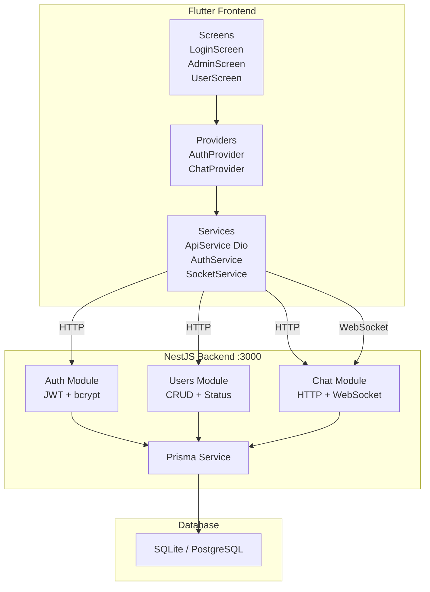

# Архитектура проекта N App

## 1. Общая архитектура

### Описание системы
Система общения администратора с пользователями. Представляет собой чат-приложение, где:
- **Администратор** может управлять пользователями (создавать, блокировать, архивировать, удалять) и общаться с ними в чате
- **Пользователи** могут отправлять сообщения администратору и получать ответы

### Стек технологий

| Компонент | Технология | Версия |
|-----------|-----------|--------|
| Backend | NestJS | ^11.0.1 |
| ORM | Prisma | ^6.19.3 |
| База данных (dev) | SQLite | через Prisma |
| База данных (prod) | PostgreSQL | через Prisma |
| Аутентификация | JWT + Passport | ^11.0.2 / ^11.0.5 |
| Хеширование паролей | bcrypt | ^6.0.0 |
| Real-time | Socket.IO | ^4.8.3 |
| Валидация | class-validator + class-transformer | ^0.15.1 / ^0.5.1 |
| Документация API | Swagger | ^11.4.4 |
| Frontend | Flutter | >=3.0.0 |
| HTTP клиент (Flutter) | Dio | ^5.4.0 |
| Состояние (Flutter) | Provider | ^6.1.1 |
| Secure Storage (Flutter) | flutter_secure_storage | ^9.0.0 |
| Socket.IO (Flutter) | socket_io_client | ^2.0.3+1 |

### Схема взаимодействия компонентов



---

## 2. Backend архитектура

### Структура модулей

```
src/
├── main.ts                          # Точка входа, Swagger, ValidationPipe
├── app.module.ts                    # Корневой модуль
├── auth/                            # Модуль аутентификации
│   ├── auth.module.ts
│   ├── auth.controller.ts           # POST /auth/login
│   ├── auth.service.ts              # Логика login + validateUser
│   ├── jwt.strategy.ts              # Passport JWT Strategy
│   ├── dto/auth.dto.ts              # LoginDto, AuthResponseDto
│   └── guards/
│       ├── jwt-auth.guard.ts        # JwtAuthGuard
│       └── roles.guard.ts           # RolesGuard
├── users/                           # Модуль управления пользователями
│   ├── users.module.ts
│   ├── users.controller.ts          # CRUD + block/unblock/archive/restore
│   ├── users.service.ts             # Бизнес-логика
│   └── dto/
│       ├── create-user.dto.ts
│       ├── update-user.dto.ts
│       └── user-response.dto.ts
├── chat/                            # Модуль чата
│   ├── chat.module.ts
│   ├── chat.controller.ts           # HTTP endpoints
│   ├── chat.service.ts              # Бизнес-логика сообщений
│   ├── chat.gateway.ts              # Socket.IO gateway
│   └── dto/
│       ├── create-message.dto.ts
│       └── message-response.dto.ts
├── common/decorators/
│   ├── current-user.decorator.ts    # @CurrentUser()
│   └── roles.decorator.ts           # @Roles()
├── config/
│   ├── config.module.ts             # Пустой модуль (заглушка)
│   └── constants.ts                 # JWT secret + expiresIn
└── prisma/
    ├── prisma.module.ts             # Global модуль
    └── prisma.service.ts            # PrismaClient lifecycle
```

### Схема БД (Prisma)

```mermaid
erDiagram
    User {
        int id PK
        string fio
        int age
        string login UK
        string passwordHash
        enum Role role
        enum UserStatus status
        datetime createdAt
        datetime updatedAt
    }

    Message {
        int id PK
        int senderId FK
        int receiverId FK
        string text
        enum MessageStatus status
        datetime createdAt
        datetime updatedAt
    }

    User ||--o{ Message : "sender (SentMessages)"
    User ||--o{ Message : "receiver (ReceivedMessages)"
```

**Enums:**
- `Role`: `ADMIN`, `USER`
- `UserStatus`: `ACTIVE`, `BLOCKED`, `ARCHIVED`
- `MessageStatus`: `SENT`, `DELIVERED`, `READ`

**Индексы:**
- `User`: `[role]`, `[status]`, `[createdAt]`
- `Message`: `[senderId, createdAt]`, `[receiverId, createdAt]`, `[status]`

### API Endpoints

#### Auth
| Метод | Путь | Доступ | Описание |
|-------|------|--------|----------|
| POST | `/auth/login` | Публичный | Вход в систему |

#### Users (только ADMIN)
| Метод | Путь | Описание |
|-------|------|----------|
| POST | `/users` | Создать пользователя |
| GET | `/users` | Список всех пользователей |
| GET | `/users/:id` | Получить пользователя |
| PATCH | `/users/:id` | Обновить пользователя |
| PATCH | `/users/:id/block` | Заблокировать |
| PATCH | `/users/:id/unblock` | Разблокировать |
| PATCH | `/users/:id/archive` | Архивировать |
| PATCH | `/users/:id/restore` | Восстановить |

#### Chat
| Метод | Путь | Доступ | Описание |
|-------|------|--------|----------|
| POST | `/chat` | Любой | Отправить сообщение |
| GET | `/chat/my` | Любой | Свои сообщения |
| GET | `/chat` | ADMIN | Все сообщения |
| GET | `/chat/user/:userId` | ADMIN | Сообщения пользователя |
| DELETE | `/chat/:id` | ADMIN | Удалить сообщение |

### Аутентификация и авторизация

1. **JWT токен** — создаётся при входе, содержит `sub` (userId), `login`, `role`
2. **Срок действия** — 7 дней (настраивается в `constants.ts`)
3. **Passport JWT Strategy** — извлекает токен из `Authorization: Bearer <token>`, валидирует пользователя через БД
4. **JwtAuthGuard** — проверяет наличие и валидность JWT
5. **RolesGuard** — проверяет наличие необходимой роли через декоратор `@Roles()`
6. **Проверка статуса** — заблокированные/архивированные пользователи не могут войти

### WebSocket (Socket.IO)

- **Gateway**: `ChatGateway` на порту 3000 (встроен в HTTP сервер)
- **Аутентификация**: JWT токен через `auth.token` или `Authorization` header
- **События**:
  - `message:send` — отправка сообщения
  - `message:read` — отметка о прочтении
  - `message:new` — новое сообщение (для получателя)
  - `message:delivered` — сообщение доставлено
  - `message:read` — сообщение прочитано
  - `user:online` / `user:offline` — статус пользователя
- **Хранение соединений**: `Map<userId, Set<socketId>>` в памяти

---

## 3. Frontend архитектура

### Структура проекта

```
frontend/lib/
├── main.dart                        # Точка входа
├── app/
│   └── app.dart                     # MaterialApp + MultiProvider + AuthGate
├── config/
│   ├── api_config.dart              # URL, таймауты, endpoints
│   └── theme.dart                   # Material 3 тема
├── models/
│   ├── user.dart                    # User модель
│   └── message.dart                 # Message модель
├── services/
│   ├── api_service.dart             # Dio singleton + JWT interceptor
│   ├── auth_service.dart            # Login/logout/token management
│   └── socket_service.dart          # Socket.IO client singleton
├── providers/
│   ├── auth_provider.dart           # AuthProvider (ChangeNotifier)
│   └── chat_provider.dart           # ChatProvider (ChangeNotifier)
└── screens/
    ├── login_screen.dart            # Экран входа
    ├── admin_screen.dart            # Панель администратора
    └── user_screen.dart             # Чат пользователя
```

### Управление состоянием (Provider)

- **`AuthProvider`** — управляет состоянием аутентификации: текущий пользователь, загрузка, ошибки
- **`ChatProvider`** — управляет сообщениями, списком пользователей (для админа), отправкой/удалением
- Оба провайдера используют `ChangeNotifier` + `Consumer`/`Consumer2` для реактивного UI

### Маршрутизация

- **`/login`** — `LoginScreen`
- **`/admin`** — `AdminScreen`
- **`/user`** — `UserScreen`
- **`_AuthGate`** — начальный экран, проверяет наличие токена и перенаправляет на соответствующий экран

### Работа с API

- **`ApiService`** — singleton на базе Dio
- **Interceptor** — автоматически добавляет `Authorization: Bearer <token>` из `FlutterSecureStorage`
- **Обработка 401** — заготовка для refresh token (пока не реализована)

### WebSocket клиент

- **`SocketService`** — singleton, подключается с JWT токеном
- Использует `socket_io_client` с транспортом `websocket`
- События: `sendMessage`, `newMessage`

---

## 4. Безопасность

### JWT токены
- Токен подписывается секретом из `JWT_SECRET` (env) или fallback `'super-secret-key-change-in-production'`
- **⚠️ Внимание**: fallback секрет указан в коде — необходимо сменить в production
- Токен содержит: `sub`, `login`, `role` — без чувствительных данных
- Срок действия: 7 дней

### Guards и роли
- `JwtAuthGuard` — обязателен для всех защищённых endpoints
- `RolesGuard` — проверяет роль через `@Roles('ADMIN')`
- Комбинация guards: `@UseGuards(JwtAuthGuard, RolesGuard)`

### Валидация данных
- Глобальный `ValidationPipe` с `whitelist: true` и `forbidNonWhitelisted: true`
- Все DTO используют декораторы `class-validator`: `@IsString()`, `@MinLength()`, `@IsInt()`, `@IsEnum()`, `@IsOptional()`
- `@Type(() => Number)` для корректного преобразования типов

### Хранение паролей
- bcrypt с солью 10 раундов
- `passwordHash` никогда не возвращается в API ответах (используется `select` в Prisma)

---

## 5. ADR (Architecture Decision Records)

### ADR-001: Выбор NestJS + Prisma

**Контекст:** Необходим структурированный backend с поддержкой TypeScript, модульной архитектурой и удобной ORM.

**Решение:** NestJS (модульная архитектура, DI, Guards) + Prisma (type-safe ORM, миграции).

**Последствия:**
- Модульная структура упрощает масштабирование
- Prisma обеспечивает type-safe запросы к БД
- Встроенная поддержка WebSocket через `@nestjs/websockets`

### ADR-002: SQLite для разработки, PostgreSQL для продакшена

**Контекст:** На этапе разработки важна скорость и простота настройки.

**Решение:** В `schema.prisma` указан `postgresql` provider, но в разработке используется SQLite через переменную `DATABASE_URL`.

**Последствия:**
- Бесшовный переход между БД через изменение `DATABASE_URL`
- Необходимо учитывать различия в типах данных между SQLite и PostgreSQL
- SQLite не поддерживает `@default(autoincrement())` для `BigInt` — используется `Int`

### ADR-003: JWT + bcrypt для аутентификации

**Контекст:** Необходима stateless аутентификация для REST API и WebSocket.

**Решение:** JWT токены с Passport.js, пароли хешируются bcrypt.

**Последствия:**
- Нет необходимости в server-side сессиях
- Токен можно использовать для аутентификации WebSocket
- 7-дневный срок действия требует механизма refresh (пока не реализован)

### ADR-004: Socket.IO для real-time чата

**Контекст:** Необходима доставка сообщений в реальном времени.

**Решение:** Socket.IO с аутентификацией через JWT, хранение соединений в памяти.

**Последствия:**
- Мгновенная доставка сообщений
- Статусы SENT → DELIVERED → READ
- **Ограничение:** при горизонтальном масштабировании потребуется Redis adapter

### ADR-005: Provider для управления состоянием Flutter

**Контекст:** Необходимо простое и эффективное управление состоянием.

**Решение:** Provider (ChangeNotifier) — стандартный подход для небольших и средних приложений.

**Последствия:**
- Минимальный boilerplate
- Встроенная поддержка в Flutter через `provider` пакет
- При росте приложения может потребоваться переход на Riverpod или Bloc

### ADR-006: Clean Architecture с Controller/Service слоями

**Контекст:** Необходимо разделение ответственности и тестируемость.

**Решение:** Controller (обработка HTTP/WebSocket) → Service (бизнес-логика) → PrismaService (доступ к данным).

**Последствия:**
- Сервисы легко тестировать изоляцией PrismaService
- Контроллеры остаются тонкими
- **Замечание:** Repository слой отсутствует — бизнес-логика напрямую использует PrismaService

---

## 6. Результаты аудита архитектуры

### Backend: найденные проблемы

| # | Категория | Проблема | Серьёзность | Рекомендация |
|---|-----------|----------|-------------|--------------|
| 1 | **SOLID (DIP)** | Нет Repository слоя — сервисы напрямую зависят от PrismaService | Средняя | Внедрить абстракцию `UserRepository`, `MessageRepository` |
| 2 | **Безопасность** | JWT secret fallback в коде (`constants.ts:2`) | Высокая | Убрать fallback, всегда использовать `process.env.JWT_SECRET` |
| 3 | **Безопасность** | Socket.IO CORS `origin: '*'` | Средняя | Ограничить origin в production |
| 4 | **DTO** | `AuthResponseDto` возвращает `passwordHash`? Нет, но нет явного exclude | Низкая | Явно указать `select` или использовать `@Exclude()` |
| 5 | **DTO** | `MessageResponseDto` не включает `updatedAt` (в отличие от select в сервисе) | Низкая | Синхронизировать DTO с select |
| 6 | **Обработка ошибок** | `ChatGateway.handleSendMessage` — нет try/catch, ошибка упадёт в сокет | Средняя | Обернуть в try/catch, эмитить ошибку клиенту |
| 7 | **Обработка ошибок** | `ChatGateway.handleReadMessage` — нет try/catch | Средняя | Обернуть в try/catch |
| 8 | **Prisma** | Нет индекса на `login` (уже есть `@unique`, но индекс для поиска не помешает) | Низкая | Уже покрыто unique constraint |
| 9 | **Prisma** | `onDelete: Restrict` на Message — нельзя удалить пользователя с сообщениями | Средняя | Рассмотреть `Cascade` или soft delete |
| 10 | **Валидация** | `CreateMessageDto.text` — `@MinLength(1)`, но нет `@MaxLength` | Низкая | Добавить `@MaxLength(1000)` |
| 11 | **Config** | `ConfigModule` пустой, не используется | Низкая | Удалить или использовать `@nestjs/config` |
| 12 | **WebSocket** | Нет rate limiting на отправку сообщений | Средняя | Добавить throttle |
| 13 | **WebSocket** | Нет валидации `CreateMessageDto` в gateway (только в HTTP) | Средняя | Использовать `ValidationPipe` для сокетов |

### Frontend: найденные проблемы

| # | Категория | Проблема | Серьёзность | Рекомендация |
|---|-----------|----------|-------------|--------------|
| 1 | **Модели** | `Message` использует `content` вместо `text` (несоответствие backend) | Высокая | Переименовать `content` → `text` в `Message` модели |
| 2 | **Модели** | `Message` использует `isRead` (bool) вместо `status` (enum) | Высокая | Заменить `isRead` на `status` с enum MessageStatus |
| 3 | **Socket** | `SocketService.sendMessage` эмитит `sendMessage`, а gateway слушает `message:send` | Высокая | Исправить event name на `message:send` |
| 4 | **Socket** | `SocketService.onNewMessage` слушает `newMessage`, а gateway эмитит `message:new` | Высокая | Исправить event name на `message:new` |
| 5 | **Socket** | `SocketService.sendMessage` передаёт `userId`, а gateway ожидает `receiverId` | Высокая | Исправить поле на `receiverId` |
| 6 | **Provider** | `ChatProvider.sendMessage` передаёт `userId` вместо `receiverId` | Средняя | Исправить параметр |
| 7 | **Provider** | `ChatProvider._setupSocketListeners` не обрабатывает `message:delivered` и `message:read` | Средняя | Добавить обработчики для обновления статусов |
| 8 | **UI** | `UserScreen._sendMessage` передаёт `auth.currentUser!.id` как receiverId (должен быть ID админа) | Высокая | Исправить: пользователь должен отправлять администратору |
| 9 | **UI** | `AdminScreen._createUser` — нет валидации полей на клиенте | Средняя | Добавить валидацию перед отправкой |
| 10 | **UI** | `AdminScreen` использует `ApiService` напрямую (минуя Provider) | Средняя | Вынести логику управления пользователями в отдельный Provider |
| 11 | **Безопасность** | Токен хранится в `FlutterSecureStorage` — корректно | OK | — |
| 12 | **Обработка ошибок** | `AuthProvider.login` — ошибка при логине не детализирована | Низкая | Пробросить текст ошибки с сервера |

---

## 7. План развития

### Краткосрочные задачи (исправление найденных проблем)
1. Исправить несоответствие моделей Message (content → text, isRead → status)
2. Исправить event names в Socket сервисе
3. Исправить отправку сообщений от пользователя (receiverId должен быть ID администратора)
4. Добавить try/catch в gateway
5. Убрать fallback JWT secret
6. Добавить валидацию DTO в gateway

### Среднесрочные задачи
1. **Подключение MinIO для файлов**
   - Хранение изображений и документов в сообщениях
   - Prisma модель `File` (messageId, url, type, name)
   - Endpoint для загрузки/скачивания

2. **Миграция на PostgreSQL**
   - Настройка PostgreSQL в production
   - Обновление `DATABASE_URL`
   - Проверка совместимости типов данных

3. **Улучшение архитектуры**
   - Внедрение Repository слоя
   - Добавление `@nestjs/config` для управления конфигурацией
   - Rate limiting для WebSocket
   - Refresh token механизм

### Долгосрочные задачи
1. **Масштабирование**
   - Redis adapter для Socket.IO (горизонтальное масштабирование)
   - Кеширование через Redis
   - Docker контейнеризация
   - CI/CD пайплайн

2. **Функциональность**
   - Групповые чаты
   - Уведомления (Push)
   - История входов (audit log)
   - Двухфакторная аутентификация