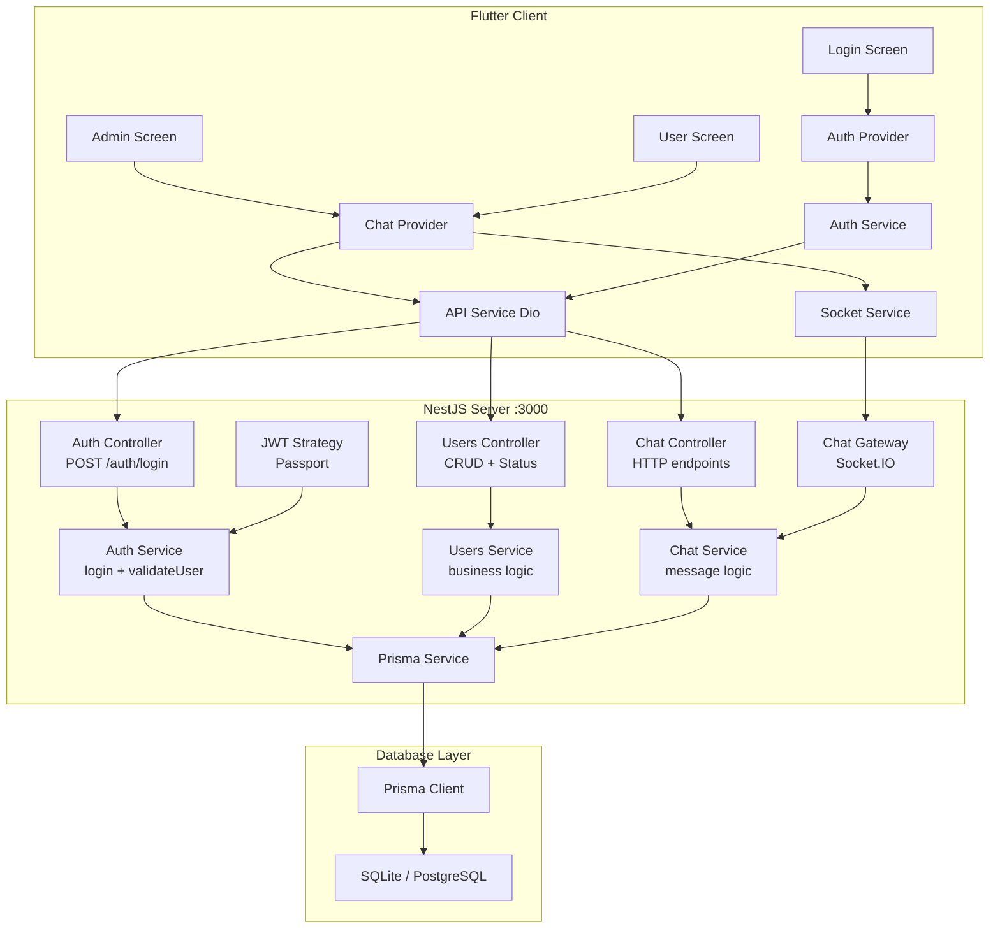
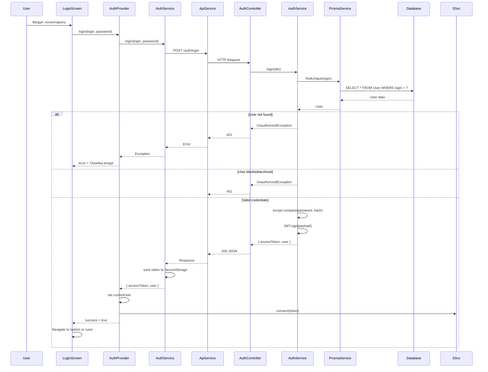
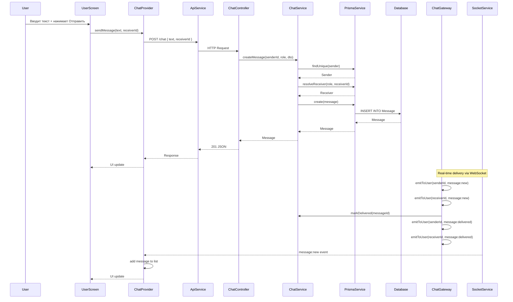
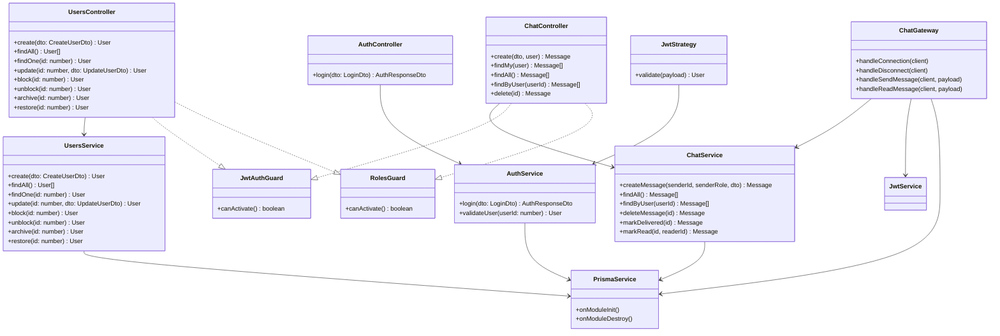
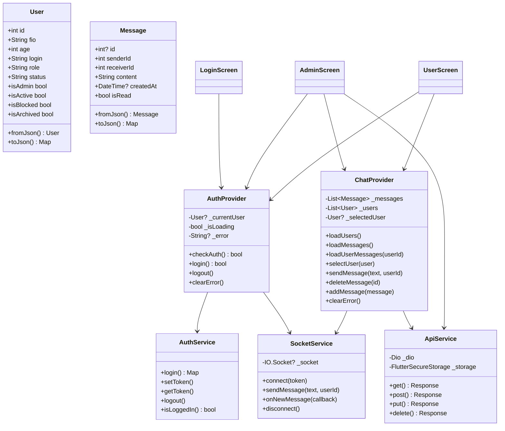
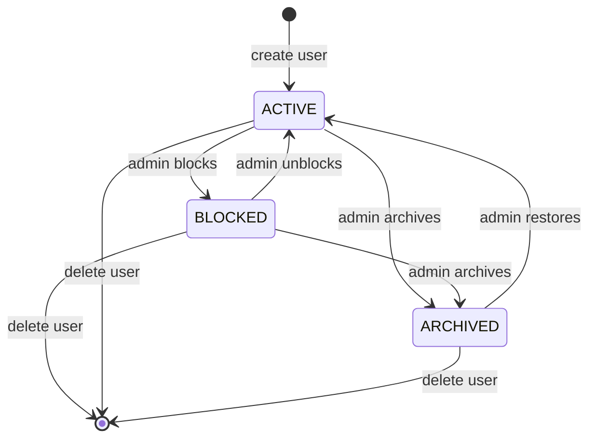
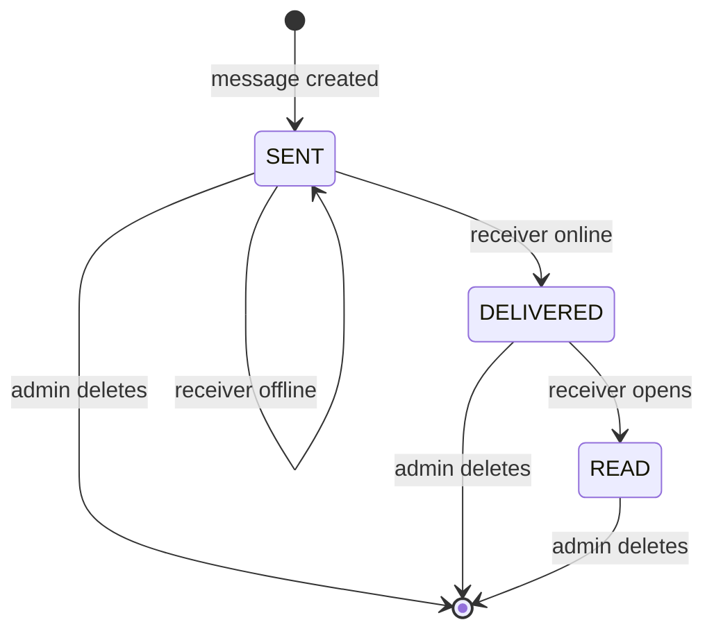
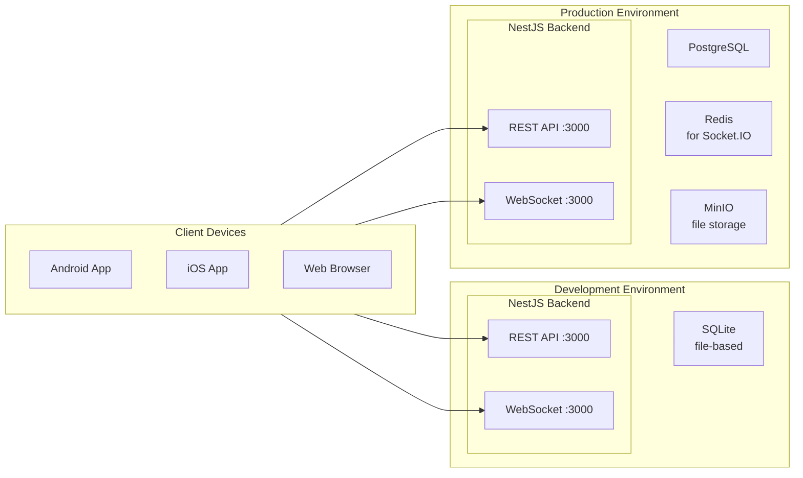

# Детальные архитектурные диаграммы

## 1. Полная диаграмма компонентов системы



---

## 2. Диаграмма последовательности аутентификации



---

## 3. Диаграмма последовательности отправки сообщения



---

## 4. Диаграмма классов Backend



---

## 5. Диаграмма классов Frontend



---

## 6. ER-диаграмма базы данных (детальная)

```mermaid
erDiagram
    User {
        int id PK "autoincrement"
        string fio "NOT NULL"
        int age "NOT NULL"
        string login UK "NOT NULL"
        string passwordHash "NOT NULL"
        enum Role role "default USER"
        enum UserStatus status "default ACTIVE"
        datetime createdAt "default now"
        datetime updatedAt "@updatedAt"
    }

    Message {
        int id PK "autoincrement"
        int senderId FK "NOT NULL"
        int receiverId FK "NOT NULL"
        string text "NOT NULL"
        enum MessageStatus status "default SENT"
        datetime createdAt "default now"
        datetime updatedAt "@updatedAt"
    }

    User ||--o{ Message : "senderId > id"
    User ||--o{ Message : "receiverId > id"

    User {
        int id PK
    }
    User {
        string login UK
    }
    User {
        enum Role role
    }
    User {
        enum UserStatus status
    }
    User {
        datetime createdAt
    }

    Message {
        int senderId
    }
    Message {
        int receiverId
    }
    Message {
        enum MessageStatus status
    }

    %% Indexes
    %% User: @@index([role], [status], [createdAt])
    %% Message: @@index([senderId, createdAt], [receiverId, createdAt], [status])
```

---

## 7. Диаграмма состояний пользователя



---

## 8. Диаграмма состояний сообщения



---

## 9. Диаграмма развёртывания



---

## 10. Диаграмма пакетов (NestJS модули)

```mermaid
flowchart TB
    subgraph AppModule["AppModule root"]
        direction TB
        PM["PrismaModule\nGlobal"]
        AM["AuthModule"]
        UM["UsersModule"]
        CM["ChatModule"]
    end

    PM --> PS["PrismaService"]
    
    subgraph AM_["AuthModule"]
        AC["AuthController"]
        AS["AuthService"]
        JS["JwtStrategy"]
        JG["JwtAuthGuard"]
        RG["RolesGuard"]
    end

    subgraph UM_["UsersModule"]
        UC["UsersController"]
        US["UsersService"]
    end

    subgraph CM_["ChatModule"]
        CC["ChatController"]
        CS["ChatService"]
        CG["ChatGateway"]
    end

    AM_ --> AM
    UM_ --> UM
    CM_ --> CM

    AM_ -->|imports| JwtModule
    AM_ -->|imports| PassportModule
    CM_ -->|imports| AM_
    
    AC --> AS
    UC --> US
    CC --> CS
    CG --> CS
    CG --> JwtService
    CG --> PS
    
    AS --> PS
    US --> PS
    CS --> PS
    JS --> AS