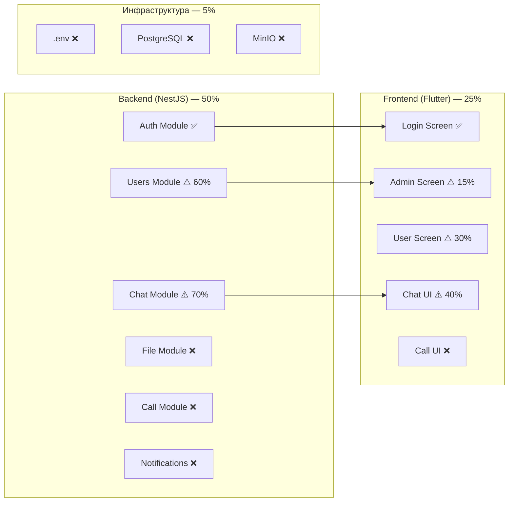

# Аудит проекта N App — Отчёт о текущем состоянии

**Дата:** 10.06.2026
**Версия проекта:** 0.0.1
**Тип:** NestJS + Flutter (Android APK)

---

## 1. Общая оценка готовности

| Компонент | Готовность | Статус |
|-----------|:----------:|--------|
| **Backend (NestJS)** | ~50% | Реализованы базовые модули, отсутствуют File, Call, Notifications |
| **Frontend (Flutter)** | ~25% | Базовая авторизация + чат, UI админа в начальном состоянии |
| **Инфраструктура** | ~5% | Нет .env, нет seed, нет миграций, нет MinIO |
| **Общий прогресс** | **~20%** | Соответствует оценке из плана (19%) |

---

## 2. Статус по этапам плана

### Этап 0: Фундамент и инфраструктура — **5%**

| Задача | Статус | Комментарий |
|--------|:------:|-------------|
| `.env` файл | ❌ | Отсутствует. В [`src/config/constants.ts`](src/config/constants.ts:2) JWT_SECRET читается из `process.env`, но файла нет |
| `.env.example` | ❌ | Отсутствует |
| PostgreSQL / миграции | ❌ | Prisma schema есть, но миграции не выполнены |
| Seed-скрипт | ❌ | Отсутствует `prisma/seed.ts` |
| CORS в `main.ts` | ❌ | В [`src/main.ts`](src/main.ts:28) нет `app.enableCors()` |
| Исправление багов | ❌ | См. раздел 4 |

### Этап 1: Модели данных (Prisma) — **30%**

| Модель | Статус | Комментарий |
|--------|:------:|-------------|
| `User` | ✅ | Базовая модель есть. Отсутствуют: `notes`, `isOnline`, `lastSeen` |
| `Message` | ✅ | Базовая модель есть. Включает `attachments` |
| `Attachment` | ✅ | Базовая модель есть. Отсутствует: `fileUrl`, `duration` |
| `Call` | ❌ | Полностью отсутствует |
| `Notification` | ❌ | Полностью отсутствует |

### Этап 2: Backend Users Module — **60%**

| Задача | Статус | Комментарий |
|--------|:------:|-------------|
| CRUD пользователей | ✅ | Полностью реализован |
| Блокировка/разблокировка | ✅ | Реализовано |
| Архивация/восстановление | ✅ | Реализовано |
| Удаление пользователей | ✅ | Реализовано |
| Поиск/сортировка/фильтрация | ✅ | Реализовано в [`QueryUsersDto`](src/users/dto/query-users.dto.ts) |
| Поле `notes` | ❌ | Отсутствует в DTO, сервисе и схеме Prisma |
| Поле `isOnline`/`lastSeen` | ❌ | Отсутствует |
| Исключение ARCHIVED по умолчанию | ❌ | [`findAll()`](src/users/users.service.ts:54) не фильтрует ARCHIVED |

### Этап 3: File Upload Module — **0%**

Полностью отсутствует. Нет `FileModule`, `FileService`, `FileController`, интеграции с MinIO.

### Этап 4: Call Module — **0%**

Полностью отсутствует. Нет `CallModule`, `CallGateway`, модели `Call`.

### Этап 5: Notifications Module — **0%**

Полностью отсутствует. Нет `NotificationModule`, `NotificationService`.

### Этап 6: Frontend рефакторинг — **10%**

| Задача | Статус | Комментарий |
|--------|:------:|-------------|
| `patch()` метод в `ApiService` | ❌ | Отсутствует. [`AdminScreen`](frontend/lib/screens/admin_screen.dart:122) вызывает `_apiService.patch()` — упадёт с ошибкой |
| Единый синглтон `SocketService` | ⚠️ | `SocketService` — синглтон (factory), но `AuthProvider` и `ChatProvider` создают свои экземпляры через `SocketService()` |
| JWT в `ChatGateway` | ❌ | [`ChatGateway.handleConnection()`](src/chat/chat.gateway.ts:19) читает `userId` из query, а не JWT из `auth.token` |
| Обработка 401 | ❌ | В [`ApiService`](frontend/lib/services/api_service.dart:35) есть заглушка, но нет редиректа на `/login` |
| Модель `User` (Dart) | ⚠️ | Базовая. Отсутствуют: `notes`, `isOnline`, `lastSeen` |
| Модель `Message` (Dart) | ⚠️ | Базовая. Отсутствуют: `attachments`, `updatedAt` |
| Модель `Call` (Dart) | ❌ | Отсутствует |
| Модель `Notification` (Dart) | ❌ | Отсутствует |

### Этап 7: Frontend UI Администратора — **15%**

| Задача | Статус | Комментарий |
|--------|:------:|-------------|
| Список пользователей | ⚠️ | Базовый список есть. Отсутствуют: поиск, сортировка, фильтры |
| Форма создания пользователя | ⚠️ | Базовая форма есть. Отсутствует: поле "Заметки", валидация |
| Карточка пользователя | ❌ | Отсутствует. Нет отдельного экрана |
| Редактирование пользователя | ❌ | Отсутствует |
| Экран архива | ❌ | Отсутствует |
| Поиск по ФИО | ❌ | Отсутствует |
| Сортировка | ❌ | Отсутствует |
| Фильтры статусов | ❌ | Отсутствуют |
| Индикаторы статуса | ⚠️ | Цветовые индикаторы есть, но нет иконок 🟢⚪🔴 |

### Этап 8: Frontend Чат с мультимедиа — **10%**

| Задача | Статус | Комментарий |
|--------|:------:|-------------|
| Текстовый чат | ✅ | Базовая отправка/получение работает |
| Пагинация | ⚠️ | Backend поддерживает, frontend не использует |
| Статусы сообщений | ❌ | Не отображаются |
| Отправка файлов | ❌ | Отсутствует |
| Голосовые сообщения | ❌ | Отсутствуют |

### Этапы 9-12 — **0%**

Полностью отсутствуют: видеозвонки, уведомления, онлайн-статус, сборка и деплой.

---

## 3. Сводная таблица готовности по модулям

| Модуль | Backend | Frontend | Среднее |
|--------|:-------:|:--------:|:-------:|
| Аутентификация (JWT) | 90% | 80% | **85%** |
| Users CRUD | 80% | 40% | **60%** |
| Чат (текстовый) | 80% | 50% | **65%** |
| Чат (файлы) | 0% | 0% | **0%** |
| Чат (голосовые) | 0% | 0% | **0%** |
| Видеозвонки | 0% | 0% | **0%** |
| Уведомления | 0% | 0% | **0%** |
| Онлайн-статус | 0% | 0% | **0%** |
| UI Администратора | — | 15% | **15%** |
| Инфраструктура | 5% | — | **5%** |

---

## 4. Ключевые проблемы и баги

### 🔴 Критические (падение приложения)

| # | Проблема | Файл | Описание |
|---|----------|------|----------|
| 1 | **Отсутствует `patch()` в `ApiService`** | [`frontend/lib/services/api_service.dart`](frontend/lib/services/api_service.dart) | Метод `patch()` вызывается в [`AdminScreen`](frontend/lib/screens/admin_screen.dart:122), но не реализован. При блокировке/разблокировке/архивации — `DioError` |
| 2 | **Socket.IO аутентификация не работает** | [`src/chat/chat.gateway.ts`](src/chat/chat.gateway.ts:19) | `ChatGateway` читает `userId` из query-параметров, а фронтенд отправляет JWT через `auth.token`. Сервер не валидирует токен — любой может подключиться |
| 3 | **Дублирование `SocketService`** | [`frontend/lib/providers/auth_provider.dart`](frontend/lib/providers/auth_provider.dart:8), [`frontend/lib/providers/chat_provider.dart`](frontend/lib/providers/chat_provider.dart:10) | `AuthProvider` и `ChatProvider` создают отдельные экземпляры `SocketService`. Хотя класс синглтон, вызов `SocketService()` в каждом провайдере создаёт иллюзию разных экземпляров. Фактически синглтон работает, но код вводит в заблуждение |

### 🟡 Высокая важность

| # | Проблема | Файл | Описание |
|---|----------|------|----------|
| 4 | **Нет `.env` файла** | — | Приложение не запустится без `JWT_SECRET`. [`constants.ts`](src/config/constants.ts:5) выбрасывает ошибку |
| 5 | **Нет обработки 401** | [`frontend/lib/services/api_service.dart`](frontend/lib/services/api_service.dart:35) | При истечении токена пользователь не перенаправляется на `/login` |
| 6 | **Нет CORS** | [`src/main.ts`](src/main.ts) | Отсутствует `app.enableCors()`. Flutter-клиент не сможет подключиться с другого хоста |
| 7 | **`findAll()` не исключает ARCHIVED** | [`src/users/users.service.ts`](src/users/users.service.ts:54) | По умолчанию возвращает всех пользователей, включая архивных. Нужно исключать `ARCHIVED` |
| 8 | **`MessageResponseDto` не включает `attachments`** | [`src/chat/dto/message-response.dto.ts`](src/chat/dto/message-response.dto.ts) | DTO не содержит поле `attachments`, хотя сервис его возвращает |

### 🟢 Низкая важность / Улучшения

| # | Проблема | Файл | Описание |
|---|----------|------|----------|
| 9 | **Нет валидации `userId` в `CreateMessageDto`** | [`src/chat/dto/create-message.dto.ts`](src/chat/dto/create-message.dto.ts) | Поле `userId` не помечено как `@IsOptional()`, хотя для USER оно не нужно |
| 10 | **`ChatGateway` не inject'ит `JwtService`** | [`src/chat/chat.gateway.ts`](src/chat/chat.gateway.ts) | Нет валидации JWT при подключении |
| 11 | **Нет `UserProvider`** | — | Управление пользователями смешано в `ChatProvider` |
| 12 | **Нет пагинации на фронтенде** | [`frontend/lib/providers/chat_provider.dart`](frontend/lib/providers/chat_provider.dart) | Backend поддерживает пагинацию, но frontend загружает все сообщения сразу |

---

## 5. Архитектурные замечания

### Backend

1. **JWT Secret хранится в коде** — [`constants.ts`](src/config/constants.ts) использует `process.env.JWT_SECRET`, что правильно, но нет `.env` файла
2. **`ConfigModule` пустой** — [`src/config/config.module.ts`](src/config/config.module.ts) не экспортирует никаких провайдеров. Лучше использовать `@nestjs/config`
3. **Нет модуля File** — Attachment уже есть в Prisma, но нет сервиса для загрузки файлов
4. **ChatGateway не использует JWT** — критическая уязвимость: любой может подключиться к WebSocket, зная userId

### Frontend

1. **Нет отдельного `UserProvider`** — `ChatProvider` перегружен: отвечает и за пользователей, и за сообщения
2. **`ApiService` не имеет `patch()`** — базовая ошибка, блокирует функционал блокировки/архивации
3. **Нет обработки ошибок сети** — при отсутствии соединения пользователь видит пустой экран
4. **Нет `CallProvider` и `NotificationProvider`** — будут нужны для видеозвонков и уведомлений

---

## 6. Рекомендуемый порядок дальнейшей реализации

### Первая очередь (критически важно — без этого проект не работает)

```
1. Этап 0.2 — Исправление критических багов:
   - Добавить patch() в ApiService
   - Исправить ChatGateway (JWT валидация)
   - Исправить синглтон SocketService
   - Добавить обработку 401

2. Этап 0.1 — Инфраструктура:
   - Создать .env и .env.example
   - Выполнить prisma:migrate
   - Создать seed-скрипт
   - Добавить CORS в main.ts
```

### Вторая очередь (базовый функционал)

```
3. Этап 1 — Модели данных:
   - Добавить модель Call
   - Добавить модель Notification
   - Добавить notes, isOnline, lastSeen в User
   - Расширить Attachment (fileUrl, duration)

4. Этап 2 — Users Module (расширение):
   - Добавить notes в DTO и сервис
   - Добавить isOnline/lastSeen
   - Исключать ARCHIVED по умолчанию

5. Этап 6 — Frontend рефакторинг:
   - Создать UserProvider
   - Обновить модели User, Message
   - Создать модели Call, Notification
```

### Третья очередь (UI и функциональность)

```
6. Этап 7 — UI Администратора (полный редизайн)
7. Этап 3 — File Upload Module (MinIO)
8. Этап 8 — Чат с мультимедиа
9. Этап 11 — Онлайн-статус
```

### Четвёртая очередь (дополнительно)

```
10. Этап 5 — Notifications Module (backend)
11. Этап 10 — Уведомления (frontend)
12. Этап 4 — Call Module (backend)
13. Этап 9 — Видеозвонки (frontend)
```

### Финальный этап

```
14. Этап 12 — Сборка APK и деплой на VPS
```

---

## 7. Диаграмма текущего состояния



---

## 8. Заключение

Проект находится на **ранней стадии разработки (~20%)**. Реализован базовый скелет:

- **Backend:** JWT-аутентификация, CRUD пользователей, текстовый чат (HTTP + WebSocket)
- **Frontend:** экран входа, базовый чат для пользователя, начальный UI администратора

**Ключевые проблемы:**
1. 3 критических бага (отсутствие `patch()`, неработающая Socket.IO аутентификация, дублирование `SocketService`)
2. Отсутствует инфраструктура (нет `.env`, миграций, CORS)
3. Не хватает 4 из 6 backend-модулей (File, Call, Notifications, расширение Users)
4. Frontend UI администратора требует полного редизайна

**Рекомендация:** начать с исправления критических багов (Этап 0.2), затем настроить инфраструктуру (Этап 0.1), после чего последовательно реализовывать этапы 1 → 2 → 6 → 7.