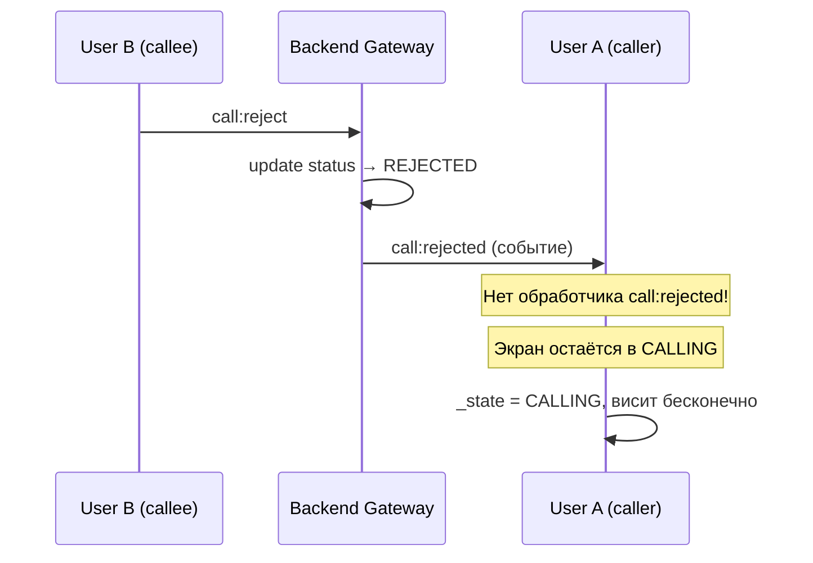
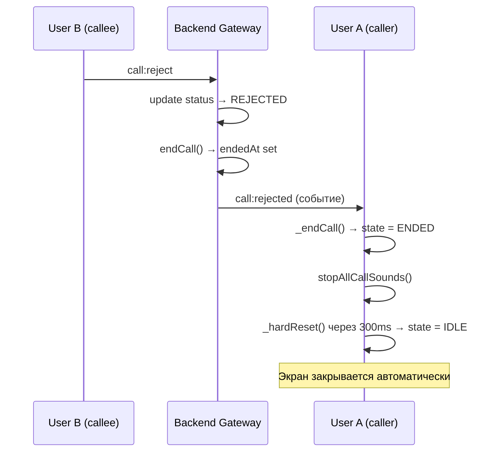

# План исправления бага: зависание экрана у caller при reject

## 1. Анализ проблемы

### 1.1. Текущая архитектура обработки reject

**Backend ([`call.gateway.ts`](src/call/call.gateway.ts):218-246):**
- Обработчик `call:reject` получает событие от callee
- Меняет статус звонка в БД на `REJECTED` через `callService.updateCallStatus()`
- Отправляет caller-у событие **`call:rejected`** (строка 232)
- **НЕ отправляет событие `call:ended`**

**Backend ([`call.service.ts`](src/call/call.service.ts):23-46):**
- `updateCallStatus()` просто меняет статус в БД, не завершает звонок (не устанавливает `endedAt`)
- При `REJECTED` не вызывается `endCall()`, звонок остаётся в статусе `REJECTED` без `endedAt`

**Frontend ([`call_service.dart`](frontend/lib/services/call_service.dart):364-368):**
- Зарегистрирован listener только на **`call:ended`**
- **Listener на `call:rejected` отсутствует** — это корень бага
- `call:ended` вызывает `_endCall()`, который:
  - Останавливает звуки (`stopAllCallSounds()`)
  - Закрывает peer connection
  - Устанавливает `_state = CallState.ENDED`
  - Через 300ms делает `_hardReset()` → `_state = IDLE`

**Frontend ([`call_screen.dart`](frontend/lib/screens/call_screen.dart):392-401):**
- `_buildControls()` при `state == CallState.ENDED` вызывает `Navigator.pop(context)` через `addPostFrameCallback`
- Экран закрывается автоматически

### 1.2. Почему экран зависает



**Цепочка проблемы:**
1. Backend **отправляет** `call:rejected` caller-у ✅
2. Frontend **не слушает** `call:rejected` ❌
3. Caller не получает никакого сигнала об отклонении
4. `_state` остаётся `CALLING`
5. Экран показывает "Звонок..." бесконечно
6. `stopAllCallSounds()` не вызывается — рингтон продолжает играть

---

## 2. План изменений

### 2.1. Backend: [`call.gateway.ts`](src/call/call.gateway.ts) — строки 218-246

**Проблема:** При `call:reject` не вызывается `callService.endCall()`, звонок не получает `endedAt`.

**Изменение:** Добавить вызов `endCall()` после `updateCallStatus()` в `handleCallReject()`.

```typescript
// Было (строка 224-234):
const call = await this.callService.updateCallStatus(
  payload.callId,
  CallStatus.REJECTED,
);
console.log(`[CALL_GATEWAY] ❌ call:reject — Call ${call.id} status updated to REJECTED`);
console.log(`[CALL_GATEWAY] ❌ call:reject — callerId=${call.callerId}`);

console.log(`[CALL_GATEWAY] ❌ call:reject — >>> Sending call:rejected to caller ${call.callerId}`);
this.sendToUser(call.callerId, 'call:rejected', {
  callId: call.id,
});

// Стало:
const call = await this.callService.updateCallStatus(
  payload.callId,
  CallStatus.REJECTED,
);
console.log(`[CALL_GATEWAY] ❌ call:reject — Call ${call.id} status updated to REJECTED`);

// Добавить: завершаем звонок (устанавливаем endedAt)
await this.callService.endCall(payload.callId);
console.log(`[CALL_GATEWAY] ❌ call:reject — Call ${call.id} ended (endedAt set)`);

console.log(`[CALL_GATEWAY] ❌ call:reject — callerId=${call.callerId}`);
console.log(`[CALL_GATEWAY] ❌ call:reject — >>> Sending call:rejected to caller ${call.callerId}`);
this.sendToUser(call.callerId, 'call:rejected', {
  callId: call.id,
});
```

### 2.2. Frontend: [`call_service.dart`](frontend/lib/services/call_service.dart) — строки 364-368

**Проблема:** Нет обработчика `call:rejected`. Caller не узнаёт, что вызов отклонён.

**Изменение:** Добавить listener на `call:rejected` сразу после listener на `call:ended` (после строки 368).

```dart
// Добавить после listener на call:ended (после строки 368):
_socketService.onCallEvent('call:rejected', (data) {
  _log('❌❌❌❌❌ call:rejected RECEIVED — data: $data');
  _log('❌ call:rejected — current state=$_state, _currentCallId=$_currentCallId');

  // Останавливаем все звуки звонка (исходящий гудок)
  CallRingtoneService().stopAllCallSounds();

  // Вызываем _endCall() — это установит state=ENDED,
  // закроет peer connection, остановит стримы,
  // а через 300ms сделает hardReset
  _endCall();
});
```

**Важно:** `_endCall()` уже содержит:
- `stopAllCallSounds()` (строка 641)
- Закрытие peer connection (строка 643)
- Установку `_state = CallState.ENDED` (строка 648)
- Отправку `_stateController.add(_state)` (строка 649)
- Сброс флагов (строка 651-652)
- Таймер на `_hardReset()` через 300ms (строка 658-661)

Поэтому `_endCall()` — идеальный метод для обработки `call:rejected`.

### 2.3. Frontend: [`call_screen.dart`](frontend/lib/screens/call_screen.dart) — строки 309-327

**Проблема:** При `state == CallState.CALLING` экран показывает "Звонок..." и кнопку завершения. Если приходит `call:rejected`, state перейдёт в `ENDED`, и `_buildControls()` при `state == CallState.ENDED` (строка 392-401) автоматически закроет экран через `Navigator.pop()`.

**Вывод:** Изменений в `call_screen.dart` **не требуется**. Механизм автоматического закрытия экрана при `state == CallState.ENDED` уже работает (строки 392-401).

### 2.4. Проверка: `call_service.dart` — `rejectCall()` (строки 438-453)

**Текущая логика:** `rejectCall()` вызывается **callee** при нажатии кнопки "Отклонить". Она:
1. Останавливает звуки (строка 443)
2. Отправляет `call:reject` на сервер (строка 448-450)
3. Вызывает `_hardReset()` (строка 452)

**Проблема:** `_hardReset()` сразу переводит `_state` в `IDLE` (строка 672). Это нормально для callee — его экран закрывается. Но для caller-а `_hardReset()` не вызывается, потому что он не получает событие.

**После исправления (п. 2.2):** Caller получит `call:rejected` → вызовет `_endCall()` → state станет `ENDED` → экран закроется. ✅

---

## 3. Итоговый список изменений

| Файл | Изменение | Строки |
|------|-----------|--------|
| [`call.gateway.ts`](src/call/call.gateway.ts) | Добавить `await this.callService.endCall(payload.callId)` после `updateCallStatus()` в `handleCallReject()` | После строки 228 |
| [`call_service.dart`](frontend/lib/services/call_service.dart) | Добавить listener на `call:rejected`, который вызывает `_endCall()` | После строки 368 |

**Никаких других изменений не требуется.**

---

## 4. Диаграмма исправленного потока



---

## 5. Риски и проверки

1. **Двойной вызов `endCall()`:** Если callee сначала нажмёт "Отклонить" (reject), а потом caller нажмёт "Завершить" (end) — `endCall()` может быть вызван дважды для одного звонка. `updateCallStatus()` в Prisma просто обновит запись, повторный вызов не сломает логику, но `endedAt` перезапишется. **Некритично.**

2. **Гонка состояний:** Если caller нажмёт "Завершить" одновременно с reject от callee — оба события уйдут на сервер. `call:end` обработается через `handleCallEnd()` (строка 248), который тоже вызовет `updateCallStatus()` и отправит `call:ended`. Это штатный сценарий, оба события приведут к закрытию экрана. **Безопасно.**

3. **Событие `call:rejected` уже отправляется сервером** (строка 232) — менять gateway не нужно для доставки события, только для установки `endedAt`.