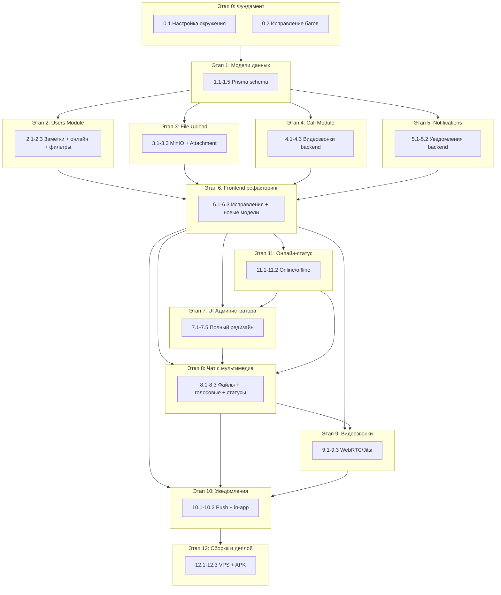
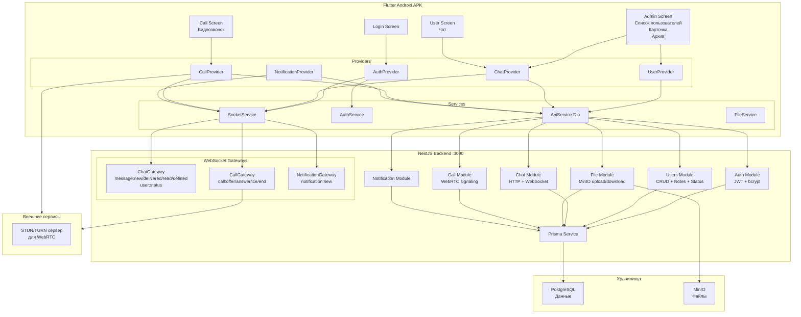

# Полный план реализации N App

## Обзор

Проект: частное Android-приложение (APK) для общения администратора с пользователями.
Текущий статус: реализовано ~19% функционала от ТЗ (текстовый чат + базовая авторизация).

---

## Этап 0: Фундамент и инфраструктура

**Цель:** Подготовить проект к разработке — настроить окружение, БД, инфраструктуру.

### 0.1 Настройка окружения

- [ ] Создать `.env` файл с переменными:
  - `JWT_SECRET` — секретный ключ для подписи токенов
  - `DATABASE_URL` — строка подключения к PostgreSQL
  - `PORT` — порт сервера (по умолчанию 3000)
  - `CORS_ORIGIN` — разрешённые источники для CORS
  - `MINIO_ENDPOINT`, `MINIO_PORT`, `MINIO_ACCESS_KEY`, `MINIO_SECRET_KEY` — для MinIO
- [ ] Создать `.env.example` как шаблон
- [ ] Установить PostgreSQL локально (или переключить Prisma на SQLite для разработки)
- [ ] Выполнить `prisma:migrate` для создания таблиц в БД
- [ ] Создать seed-скрипт `prisma/seed.ts` для первого администратора
- [ ] Настроить CORS в `main.ts` через `app.enableCors()`

### 0.2 Исправление существующих багов

- [ ] Добавить метод `patch()` в `ApiService` (Flutter) — иначе `AdminScreen` упадёт
- [ ] Исправить Socket.IO аутентификацию: `ChatGateway` должен принимать `auth.token` и валидировать JWT
- [ ] Исправить синглтон `SocketService` — `AuthProvider` и `ChatProvider` должны использовать один экземпляр
- [ ] Добавить обработку 401 (token expired) — редирект на `/login`

---

## Этап 1: Модели данных (Prisma)

**Цель:** Расширить схему БД для поддержки всего функционала ТЗ.

### 1.1 Новая модель `Call` (история звонков)

```prisma
model Call {
  id          Int      @id @default(autoincrement())
  callerId    Int
  calleeId    Int
  status      CallStatus @default(MISSED) // COMPLETED, MISSED, CANCELLED
  startedAt   DateTime @default(now())
  endedAt     DateTime?
  duration    Int?     // в секундах

  caller      User     @relation("Caller", fields: [callerId], references: [id])
  callee      User     @relation("Callee", fields: [calleeId], references: [id])

  @@index([callerId])
  @@index([calleeId])
  @@index([startedAt])
}

enum CallStatus {
  COMPLETED
  MISSED
  CANCELLED
}
```

### 1.2 Добавить поле `notes` в модель `User`

```prisma
model User {
  // ... существующие поля
  notes          String?    // заметки администратора
  // ...
}
```

### 1.3 Добавить поле `isOnline` в модель `User` (или отдельная модель)

Вариант А (проще): добавить поле в User
```prisma
model User {
  // ...
  isOnline       Boolean    @default(false)
  lastSeen       DateTime?
  // ...
}
```

Вариант Б (лучше для масштабирования): отдельная модель `UserSession`
```prisma
model UserSession {
  id        Int      @id @default(autoincrement())
  userId    Int
  socketId  String
  connectedAt DateTime @default(now())
  disconnectedAt DateTime?

  user      User     @relation(fields: [userId], references: [id], onDelete: Cascade)

  @@index([userId])
  @@index([socketId])
}
```

### 1.4 Расширить модель `Attachment` для поддержки типов файлов

```prisma
model Attachment {
  id        Int      @id @default(autoincrement())
  messageId Int
  message   Message  @relation(fields: [messageId], references: [id], onDelete: Cascade)
  fileName  String
  fileType  String   // image/jpeg, video/mp4, audio/ogg, application/pdf
  fileSize  Int
  fileUrl   String   // URL в MinIO
  duration  Int?     // для аудио/видео (в секундах)
  createdAt DateTime @default(now())

  @@index([messageId])
}
```

### 1.5 Модель `Notification` (уведомления)

```prisma
model Notification {
  id        Int      @id @default(autoincrement())
  userId    Int
  type      NotificationType // NEW_MESSAGE, INCOMING_CALL
  title     String
  body      String
  data      String?  // JSON с дополнительными данными
  isRead    Boolean  @default(false)
  createdAt DateTime @default(now())

  user      User     @relation(fields: [userId], references: [id], onDelete: Cascade)

  @@index([userId, isRead])
  @@index([createdAt])
}

enum NotificationType {
  NEW_MESSAGE
  INCOMING_CALL
}
```

---

## Этап 2: Backend — Users Module (расширение)

**Цель:** Добавить поддержку заметок, онлайн-статуса, карточки пользователя.

### 2.1 Добавить поле `notes` в DTO и сервис

- [ ] `CreateUserDto` — добавить `notes?: string`
- [ ] `UpdateUserDto` — добавить `notes?: string`
- [ ] `UserResponseDto` — добавить `notes`, `isOnline`, `lastSeen`
- [ ] `UsersService.create()` — сохранять `notes`
- [ ] `UsersService.update()` — обновлять `notes`
- [ ] `UsersService.findOne()` — возвращать `notes`, `isOnline`, `lastSeen`
- [ ] `UsersService.findAll()` — исключать `ARCHIVED` по умолчанию (согласно ТЗ)

### 2.2 Онлайн-статус через WebSocket

- [ ] `ChatGateway.handleConnection()` — устанавливать `isOnline = true`, `lastSeen = now()`
- [ ] `ChatGateway.handleDisconnect()` — устанавливать `isOnline = false`, `lastSeen = now()`
- [ ] Эмитить событие `user:status` всем администраторам при изменении статуса
- [ ] Добавить endpoint `PATCH /users/:id/status` (только для внутреннего использования)

### 2.3 Фильтрация списка пользователей

- [ ] `QueryUsersDto` — добавить `status` фильтр (ALL, ACTIVE, BLOCKED)
- [ ] `UsersService.findAll()` — по умолчанию исключать `ARCHIVED`
- [ ] Добавить endpoint `GET /users/archive` для получения архивных

---

## Этап 3: Backend — File Upload Module

**Цель:** Реализовать загрузку, хранение и прикрепление файлов к сообщениям.

### 3.1 Интеграция MinIO

- [ ] Установить `@minio/client` или использовать `aws-sdk` (S3-совместимый)
- [ ] Создать `FileModule` с `FileService`
- [ ] `FileService.upload(file, bucket)` — загрузка в MinIO
- [ ] `FileService.getFileUrl(fileId)` — получение URL
- [ ] `FileService.deleteFile(fileId)` — удаление из MinIO
- [ ] Создать `FileController`:
  - `POST /files/upload` — загрузка файла (multipart)
  - `GET /files/:id` — получение файла
  - `DELETE /files/:id` — удаление файла (только ADMIN)

### 3.2 Прикрепление файлов к сообщениям

- [ ] `CreateMessageDto` — добавить `fileIds?: number[]`
- [ ] `ChatService.create()` — прикреплять файлы к сообщению
- [ ] `MessageResponseDto` — добавить `attachments: Attachment[]`

### 3.3 Поддержка типов файлов

- [ ] Валидация MIME-типов: изображения, видео, аудио, документы
- [ ] Ограничение размера файла (например, 50MB)
- [ ] Генерация thumbnail для изображений (опционально)

---

## Этап 4: Backend — Call Module (видеозвонки)

**Цель:** Реализовать сигнализацию для видеозвонков через WebSocket.

### 4.1 Модель и модуль звонков

- [ ] Создать `CallModule` с `CallService` и `CallGateway`
- [ ] `CallService.create(callerId, calleeId)` — создать запись звонка
- [ ] `CallService.updateStatus(callId, status)` — обновить статус
- [ ] `CallService.getHistory(userId)` — история звонков

### 4.2 WebSocket события для звонков

- `call:offer` — предложение звонка (SDP offer)
- `call:answer` — ответ на звонок (SDP answer)
- `call:ice-candidate` — ICE кандидаты
- `call:end` — завершение звонка
- `call:missed` — пропущенный звонок
- `call:toggle-camera` — вкл/выкл камеру
- `call:toggle-mic` — вкл/выкл микрофон
- `call:switch-camera` — переключение камеры

### 4.3 HTTP endpoints

- `POST /calls` — инициировать звонок
- `GET /calls/history` — история звонков (ADMIN — все, USER — свои)
- `GET /calls/:id` — детали звонка

---

## Этап 5: Backend — Notifications Module

**Цель:** Уведомления о новых сообщениях и звонках.

### 5.1 Модель и модуль уведомлений

- [ ] Создать `NotificationModule` с `NotificationService`
- [ ] `NotificationService.create(userId, type, title, body, data)` — создать уведомление
- [ ] `NotificationService.getUnread(userId)` — непрочитанные
- [ ] `NotificationService.markAsRead(notificationId)` — отметить прочитанным
- [ ] `NotificationService.markAllAsRead(userId)` — все прочитаны

### 5.2 WebSocket события

- `notification:new` — новое уведомление
- `notification:read` — уведомление прочитано

### 5.3 HTTP endpoints

- `GET /notifications` — список уведомлений
- `PATCH /notifications/:id/read` — отметить прочитанным
- `PATCH /notifications/read-all` — все прочитаны

---

## Этап 6: Frontend — Рефакторинг и исправление багов

**Цель:** Исправить существующие проблемы перед добавлением нового функционала.

### 6.1 Исправление критических багов

- [ ] Добавить `patch()` метод в `ApiService`
- [ ] Исправить `SocketService` — сделать единый синглтон через Provider
- [ ] Исправить `ChatGateway` — принимать JWT через `auth.token`, извлекать `userId` из токена
- [ ] Добавить обработку 401 — перехватчик в `ApiService` с редиректом на `/login`

### 6.2 Рефакторинг моделей

- [ ] `Message` — добавить `attachments`, `updatedAt`
- [ ] `User` — добавить `notes`, `isOnline`, `lastSeen`
- [ ] Создать модель `Call` (Dart)
- [ ] Создать модель `Notification` (Dart)

### 6.3 Рефакторинг провайдеров

- [ ] Выделить `UserProvider` для управления пользователями (отдельно от чата)
- [ ] `ChatProvider` — добавить поддержку файлов, статусов, пагинации
- [ ] `CallProvider` — управление видеозвонками
- [ ] `NotificationProvider` — управление уведомлениями

---

## Этап 7: Frontend — UI Администратора (полный редизайн)

**Цель:** Реализовать UI в точном соответствии с ТЗ.

### 7.1 Экран списка пользователей

- [ ] Поиск по ФИО (TextField в верхней части)
- [ ] Сортировка: по алфавиту, по возрасту, по дате создания (Dropdown)
- [ ] Фильтры: Все / Активные / Заблокированные (Chips или SegmentedButtons)
- [ ] Индикаторы статуса: 🟢 онлайн, ⚪ офлайн, 🔴 заблокирован
- [ ] Кнопка "Добавить пользователя" внизу экрана
- [ ] Кнопка "Архив" в AppBar или внизу

### 7.2 Форма создания пользователя

- [ ] Поля: ФИО, Возраст, Заметки администратора, Логин, Пароль
- [ ] Валидация всех полей
- [ ] Кнопка "Создать пользователя"

### 7.3 Карточка пользователя

- [ ] Отображение: ФИО, Возраст, Статус, Дата создания, Заметки администратора
- [ ] Кнопки: Редактировать данные, Начать чат, Заблокировать/Разблокировать, Отправить в архив
- [ ] Блок "Доступ в систему": поля Новый логин, Новый пароль, кнопка "Сохранить логин и пароль"

### 7.4 Редактирование пользователя

- [ ] Поля становятся редактируемыми: ФИО, Возраст, Заметки администратора
- [ ] Кнопка "Сохранить данные"

### 7.5 Экран архива

- [ ] Список архивных пользователей
- [ ] Для каждого: просмотр карточки, просмотр истории, восстановить, удалить
- [ ] Подтверждение удаления

---

## Этап 8: Frontend — Чат с мультимедиа

**Цель:** Добавить поддержку файлов, голосовых сообщений, статусов.

### 8.1 Текстовый чат (улучшение)

- [ ] Пагинация (загрузка истории порциями)
- [ ] Статусы сообщений: SENT ✓, DELIVERED ✓✓, READ ✓✓ синие
- [ ] Авто-скролл к последнему сообщению
- [ ] Индикатор "печатает" (опционально)

### 8.2 Отправка файлов

- [ ] Кнопка прикрепления файлов (иконка скрепки)
- [ ] Выбор: фото (камера/галерея), видео, аудио, документы
- [ ] Предпросмотр перед отправкой
- [ ] Индикатор загрузки (progress bar)
- [ ] Отображение вложений в сообщениях:
  - Изображения — preview
  - Видео — плеер
  - Аудио — плеер
  - Документы — иконка + название

### 8.3 Голосовые сообщения

- [ ] Кнопка записи (иконка микрофона)
- [ ] Запись аудио через `flutter_sound` или `record`
- [ ] Отображение длительности
- [ ] Воспроизведение в чате

---

## Этап 9: Frontend — Видеозвонки (WebRTC / Jitsi Meet)

**Цель:** Реализовать видеозвонки между администратором и пользователем.

### 9.1 Выбор технологии

**Вариант А: Jitsi Meet (рекомендуется)**
- Плюсы: готовая инфраструктура, не нужно писать сигнализацию
- Минусы: требуется Jitsi сервер или публичный инстанс
- Пакет: `jitsi_meet_flutter_sdk`

**Вариант Б: WebRTC (кастомный)**
- Плюсы: полный контроль, нет зависимости от внешних сервисов
- Минусы: сложная реализация, нужно STUN/TURN серверы
- Пакет: `flutter_webrtc`

### 9.2 UI видеозвонка

- [ ] Экран звонка с видео обоих участников (pip)
- [ ] Кнопки: камера вкл/выкл, микрофон вкл/выкл, завершить, переключить камеру
- [ ] Индикация входящего звонка (отдельный экран)
- [ ] Звук вызова

### 9.3 Интеграция с WebSocket

- [ ] Сигнализация через Socket.IO (offer, answer, ICE)
- [ ] Обновление статуса звонка в БД
- [ ] Уведомление о входящем звонке

---

## Этап 10: Frontend — Уведомления

**Цель:** Push-уведомления о новых сообщениях и звонках.

### 10.1 Локальные уведомления

- [ ] Пакет: `flutter_local_notifications`
- [ ] Уведомление при новом сообщении (когда приложение в фоне)
- [ ] Уведомление при входящем звонке
- [ ] Нажатие на уведомление открывает соответствующий экран

### 10.2 In-app уведомления

- [ ] Toast/SnackBar при новом сообщении
- [ ] Счётчик непрочитанных сообщений
- [ ] Список уведомлений (опционально)

---

## Этап 11: Онлайн-статус

**Цель:** Автоматическое определение и отображение статуса онлайн/офлайн.

### 11.1 Backend

- [ ] `ChatGateway.handleConnection()` — установить `isOnline = true`
- [ ] `ChatGateway.handleDisconnect()` — установить `isOnline = false`
- [ ] Эмит `user:status` всем подключённым администраторам
- [ ] Heartbeat (ping/pong) для определения разрыва соединения

### 11.2 Frontend

- [ ] Слушать событие `user:status`
- [ ] Обновлять индикатор в списке пользователей
- [ ] Обновлять индикатор в шапке чата
- [ ] 🟢 — онлайн, ⚪ — офлайн, 🔴 — заблокирован

---

## Этап 12: Сборка и деплой

**Цель:** Подготовить проект к сборке APK и деплою на VPS.

### 12.1 Backend (VPS)

- [ ] Установить Node.js, PostgreSQL, MinIO на VPS
- [ ] Настроить PM2 для управления процессом
- [ ] Настроить Nginx как reverse proxy (SSL, HTTP/2)
- [ ] Настроить systemd сервис для автозапуска
- [ ] Скопировать `.env` с production-настройками
- [ ] Выполнить `prisma:migrate` и `prisma:seed`

### 12.2 Frontend (APK)

- [ ] Настроить `android/app/build.gradle` (applicationId, version, signing)
- [ ] Создать keystore для подписи APK
- [ ] Выполнить `flutter build apk --release`
- [ ] Протестировать установку APK на устройстве

### 12.3 MinIO

- [ ] Установить и настроить MinIO на VPS
- [ ] Создать bucket для файлов
- [ ] Настроить политики доступа

---

## Диаграмма зависимостей этапов



---

## Архитектурная диаграмма (полная)



---

## Сводная таблица этапов

| Этап | Название | Задач | Зависит от | Оценка сложности |
|------|----------|-------|------------|:----------------:|
| 0 | Фундамент и инфраструктура | 8 | — | Средняя |
| 1 | Модели данных (Prisma) | 5 | Этап 0 | Средняя |
| 2 | Backend Users Module | 8 | Этап 1 | Средняя |
| 3 | Backend File Upload | 8 | Этап 1 | Высокая |
| 4 | Backend Call Module | 6 | Этап 1 | Высокая |
| 5 | Backend Notifications | 6 | Этап 1 | Средняя |
| 6 | Frontend рефакторинг | 8 | Этапы 2-5 | Средняя |
| 7 | Frontend UI Администратора | 20 | Этап 6 | Высокая |
| 8 | Frontend Чат с мультимедиа | 12 | Этапы 6-7 | Высокая |
| 9 | Frontend Видеозвонки | 8 | Этапы 6, 8 | Очень высокая |
| 10 | Frontend Уведомления | 5 | Этап 6 | Средняя |
| 11 | Онлайн-статус | 5 | Этапы 2, 6 | Низкая |
| 12 | Сборка и деплой | 8 | Все этапы | Средняя |

**Всего задач:** ~99

---

## Приоритет выполнения

### Первая очередь (критически важно для запуска)
1. **Этап 0** — без этого проект не запустится
2. **Этап 1** — без новых моделей нельзя реализовать функционал
3. **Этап 2** — заметки, онлайн-статус, фильтрация
4. **Этап 6** — исправление багов frontend
5. **Этап 7** — UI администратора (основной интерфейс)

### Вторая очередь (функциональность)
6. **Этап 3** — загрузка файлов
7. **Этап 8** — чат с мультимедиа
8. **Этап 11** — онлайн-статус

### Третья очередь (дополнительно)
9. **Этап 5** — уведомления
10. **Этап 10** — уведомления frontend

### Четвёртая очередь (сложные функции)
11. **Этап 4** — видеозвонки backend
12. **Этап 9** — видеозвонки frontend

### Финальный этап
13. **Этап 12** — сборка APK и деплой на VPS